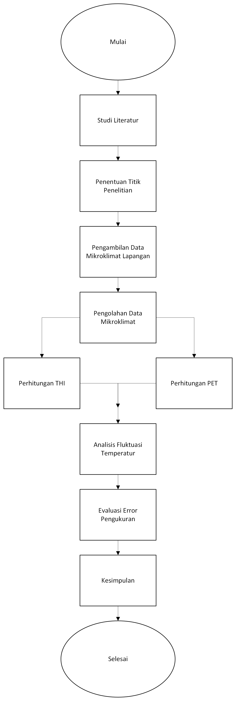

# Thermal Comfort Analysis

This repository contains a research project for the Fundamental Engineering Design course at Telkom University.

The project analyzes outdoor thermal comfort at several locations around the campus using the Temperature Humidity Index (THI) and Physiological Equivalent Temperature (PET). Environmental data were collected through field measurements, while Python was used to calculate the PET values.

## Project Workflow



## About the Project

The purpose of this project was to evaluate outdoor thermal comfort in different outdoor areas at Telkom University.

Our team collected environmental data, cleaned the datasets, calculated THI and PET, and analyzed the results to compare thermal comfort at each measurement location. The final results were documented in a research paper and presented through a project poster.

## My Role

I contributed to both the field measurements and the data analysis. My responsibilities included:

- Collecting environmental data using two anemometers together with my teammates.
- Cleaning and organizing the measurement data.
- Calculating the Temperature Humidity Index (THI).
- Calculating the Physiological Equivalent Temperature (PET) using Python.
- Calculating standard deviation, measurement uncertainty, and measurement error.
- Writing parts of the research paper and reviewing related references.

## Challenges

One of the main challenges was preparing the measurement data.

Since two anemometers were used during data collection, some measurement values were slightly different. Before starting the analysis, the data had to be checked, compared, and cleaned to produce a reliable dataset.

Another challenge was learning how to calculate PET because it was a new topic for me. Writing the research paper and finding relevant references also required a lot of time.

## What I Learned

This project gave me experience working with real environmental measurement data.

I learned that data collection is only the first step. Before performing any analysis, the data must be checked and cleaned carefully to reduce errors.

I also improved my Python skills for engineering calculations and became more familiar with thermal comfort analysis, basic statistical calculations, and technical writing.

## Tools

- Python
- pythermalcomfort
- Microsoft Excel

## Repository Structure

```text
thermal-comfort-analysis/
│
├── code/
├── data/
├── results/
├── images/
├── poster/
├── paper/
└── README.md
```

## How to Run

1. Clone this repository.
2. Open the `code` folder.
3. Install the required library:

```bash
pip install pythermalcomfort
```

4. Run the Python script.

## Team

This project was completed by a team of three students. We worked together during the field measurements and divided the remaining tasks, including data processing, analysis, documentation, and presentation.
